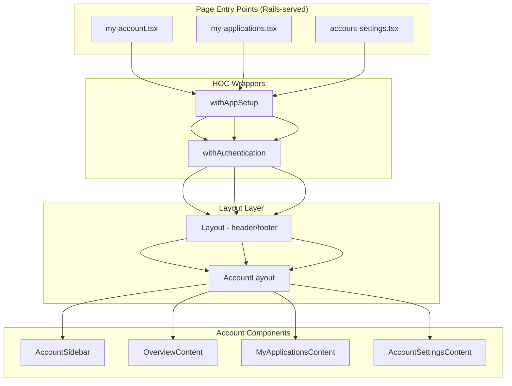

# Design Document: Account Dashboard Redesign

## Overview

This design transforms the `/my-account` page from a card-based layout into a two-pane layout with persistent sidebar navigation. A new `AccountLayout` component provides a shared shell for all account pages (`/my-account`, `/my-applications`, `/account-settings`), rendering a left sidebar with navigation links and a right content area that displays the active section.

The redesign preserves all existing functionality—authentication, i18n, application management, and account settings—while improving navigation discoverability and consistency across account pages.

### Key Design Decisions

1. **Shared layout component, not SPA routing**: Since pages are served by Rails as separate routes, `AccountLayout` determines the active section from `window.location.pathname` rather than React Router state.
2. **Content extraction pattern**: Existing pages (`my-applications.tsx`, `account-settings.tsx`) have their inner content extracted into standalone components that render inside `AccountLayout`, while the page-level files continue to compose `withAppSetup` and `withAuthentication`.
3. **Sidebar as a `<nav>` landmark**: The sidebar uses semantic HTML with `aria-current="page"` for the active item, meeting accessibility requirements without additional ARIA complexity.
4. **Content width adjustments**: Existing pages use constrained max-widths (`max-w-2xl` for applications, `md:max-w-lg` for settings) centered on the full page. When embedded in the content area, these constraints are removed so content fills the available width of the right pane.

## Architecture



### Component Hierarchy

Each page entry point follows this structure:

```
withAppSetup
  └── withAuthentication
        └── Layout (header + footer)
              └── AccountLayout
                    ├── AccountSidebar (left pane)
                    └── Content Area (right pane)
                          └── [OverviewContent | MyApplicationsContent | AccountSettingsContent]
```

## Components and Interfaces

### AccountLayout

**File**: `app/javascript/layouts/AccountLayout.tsx`

```typescript
interface AccountLayoutProps {
  children: React.ReactNode
}
```

Responsibilities:
- Renders the two-pane grid (sidebar + content area)
- Handles responsive stacking (sidebar above content on mobile)
- Passes no props to sidebar—sidebar self-determines active state from URL

### AccountSidebar

**File**: `app/javascript/pages/account/components/AccountSidebar.tsx`

```typescript
interface NavItem {
  label: string           // i18n key resolved via t()
  href: string            // localized path from routeUtil
  icon: UniversalIconType // icon symbol name
  isActive: boolean       // derived from current URL
  onClick?: () => void    // only for Sign out
}

interface AccountSidebarProps {
  // No props needed—derives active state from window.location.pathname
}
```

Responsibilities:
- Renders `<nav aria-label={t("nav.accountNavigation")}>` landmark
- Displays "ACCOUNT" heading
- Renders navigation items with icons
- Applies `aria-current="page"` and blue left border to active item
- Handles Sign out action via `UserContext.signOut()`

### OverviewContent

**File**: `app/javascript/pages/account/components/OverviewContent.tsx`

```typescript
interface OverviewContentProps {
  // No props—reads user from UserContext
}
```

Responsibilities:
- Displays personalized greeting ("Hi, {firstName}" or generic fallback)
- Renders summary cards linking to applications and settings pages
- Renders "Sign out of account" link at bottom

### Active Section Detection

```typescript
// Utility function in AccountSidebar
const getActiveSection = (pathname: string): string => {
  const pathWithoutLang = getPathWithoutLanguagePrefix(pathname)
  if (pathWithoutLang.startsWith("/my-applications")) return "applications"
  if (pathWithoutLang.startsWith("/account-settings")) return "settings"
  return "overview" // default for /my-account
}
```

## Content Styling Adjustments

When extracting existing page content into the `AccountLayout` content area, the following width/centering overrides must be applied:

### MyApplicationsContent

The current `my-applications.tsx` wraps its content in:
```html
<section className="bg-gray-300 border-t border-gray-450">
  <div className="flex flex-wrap relative max-w-2xl mx-auto sm:py-8">
```

The extracted `MyApplicationsContent` component removes the outer `<section>` (background handled by `AccountLayout`) and removes `max-w-2xl mx-auto` so the card fills the content area width. The content pane itself provides appropriate padding.

### AccountSettingsContent

The current `account-settings.tsx` wraps its content in:
```html
<section className="bg-gray-300 md:border-t md:border-gray-450">
  <div className="flex flex-wrap relative md:max-w-lg mx-auto md:py-8">
```

The extracted `AccountSettingsContent` component removes the outer `<section>` and replaces `md:max-w-lg mx-auto` with `w-full` so the form card expands to fill the content area. The form's internal padding (`p-2 md:py-2 md:px-10`) is preserved.

### General Pattern

For both extracted content components:
- Remove the `<Layout>` wrapper (handled by the page entry point)
- Remove the outer `<section>` with background color (handled by `AccountLayout`)
- Remove `max-w-*` and `mx-auto` centering constraints
- Preserve internal card structure, padding, and all functional behavior

## Data Models

### Navigation Configuration

```typescript
// Static navigation item configuration
const NAV_ITEMS: Array<{
  key: string
  labelKey: string        // i18n translation key
  pathGetter: () => string
  icon: UniversalIconType
  section: string         // matches getActiveSection return values
}> = [
  {
    key: "overview",
    labelKey: "nav.myDashboard",
    pathGetter: getMyAccountPath,
    icon: "profile",
    section: "overview",
  },
  {
    key: "applications",
    labelKey: "nav.myApplications",
    pathGetter: getMyApplicationsPath,
    icon: "application",
    section: "applications",
  },
  {
    key: "settings",
    labelKey: "accountSettings.title.sentenceCase",
    pathGetter: getMyAccountSettingsPath,
    icon: "settings",
    section: "settings",
  },
]
```

### User Data (existing, unchanged)

```typescript
interface User {
  uid: string
  id: number
  email: string
  firstName?: string
  middleName?: string
  lastName?: string
  DOB?: string
  dobObject?: { birthDay: string; birthMonth: string; birthYear: string }
}
```

No new data models or API changes are required. The redesign is purely a UI/layout restructuring using existing data from `UserContext`.


## Correctness Properties

*A property is a characteristic or behavior that should hold true across all valid executions of a system—essentially, a formal statement about what the system should do. Properties serve as the bridge between human-readable specifications and machine-verifiable correctness guarantees.*

### Property 1: Active section detection is correct for all valid account paths

*For any* valid account URL path (with or without a language prefix, with or without query parameters), the `getActiveSection` function SHALL return the correct section identifier, and the corresponding navigation item SHALL be rendered with both the active visual indicator (blue left border class) and `aria-current="page"`.

**Validates: Requirements 2.5, 2.6, 5.2**

### Property 2: Greeting includes the user's first name when available

*For any* non-empty `firstName` string, the rendered greeting text SHALL contain that exact `firstName` value.

**Validates: Requirements 3.1, 3.2**

## Error Handling

| Scenario | Handling |
|----------|----------|
| `UserContext.profile` is undefined/loading | `withAuthentication` HOC returns `null` (shows nothing) until profile loads, then redirects if no valid token |
| `profile.firstName` is undefined/null/empty | OverviewContent falls back to a generic greeting without a name |
| Sign out fails | `UserContext.signOut()` clears local tokens and redirects to sign-in regardless of API response |
| Navigation path resolution fails | `localizedPathGetter` falls back to English path if language prefix is invalid |
| Translation key missing | `t()` returns the key string itself as fallback (existing behavior) |

No new error states are introduced by this redesign. All error handling relies on existing mechanisms in `withAuthentication`, `UserContext`, and the `t()` i18n system.

## Testing Strategy

### Unit Tests (Example-Based)

Focus on specific rendering and interaction scenarios:

- **AccountLayout**: Renders both panes; applies stacking classes at mobile breakpoint
- **AccountSidebar**: Renders all four nav items in correct order; "ACCOUNT" heading present; Sign out calls `signOut()` and redirects; nav items have correct `href` values; `<nav>` landmark with `aria-label` present; keyboard activation works
- **OverviewContent**: Renders greeting with name; renders generic greeting when no name; renders both summary cards with correct links; renders sign out link
- **Integration**: Each page (my-account, my-applications, account-settings) renders within AccountLayout; authentication is enforced

### Property-Based Tests

Using `fast-check` for property-based testing (already available in the JS/TS ecosystem with Jest):

- **Property 1**: Generate random URL paths combining language prefixes (`/es/`, `/zh/`, `/tl/`, or none), account path segments (`/my-account`, `/my-applications`, `/account-settings`), and optional query strings. Verify `getActiveSection` returns the correct section for each. Minimum 100 iterations.
- **Property 2**: Generate random non-empty strings (including unicode, special characters, spaces). Verify the greeting construction includes the firstName. Minimum 100 iterations.

**Test Configuration:**
- Library: `fast-check` with Jest
- Minimum iterations: 100 per property
- Tag format: `Feature: account-dashboard-redesign, Property {number}: {property_text}`

### Accessibility Testing

- Verify `<nav>` landmark with descriptive `aria-label`
- Verify `aria-current="page"` on active item
- Verify logical DOM order (sidebar before content)
- Verify all interactive elements are keyboard-accessible (links are natively keyboard-accessible)
